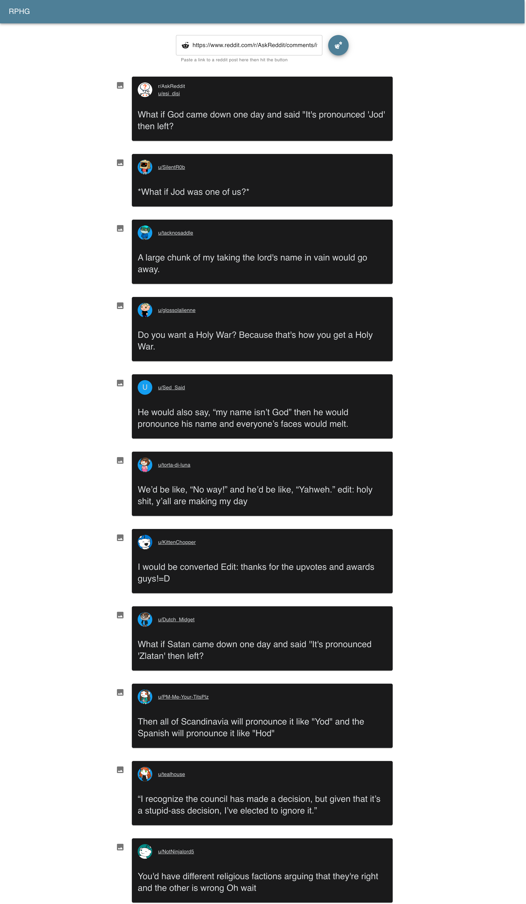

# welcome to reddit-post-highlight-generator

a tool that generated highlights for a single reddit post

built with

- [reactjs](https://reactjs.org/)
- [material-ui](https://material-ui.com/)
- [redux-toolkit](https://redux-toolkit.js.org/)

## why?
I usually take screenshots from https://www.reddit.com/r/AskReddit but it's annoying to keep cropping images, so I created this tool to simplify it

## to use it 
go here 
https://mohammedal-rowad.github.io/reddit-post-highlight-generator/

try adding this link in the input for example

https://www.reddit.com/r/AskReddit/comments/iwedc5/what_if_god_came_down_one_day_and_said_its/

  
result

  
  

